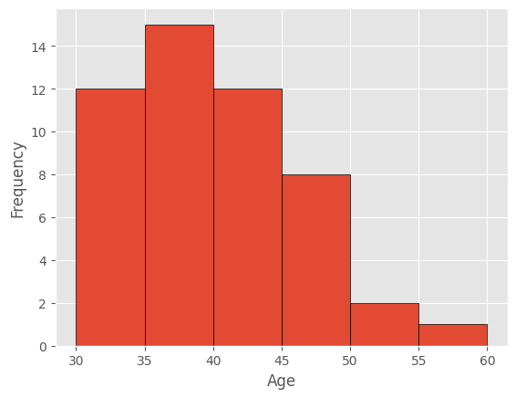
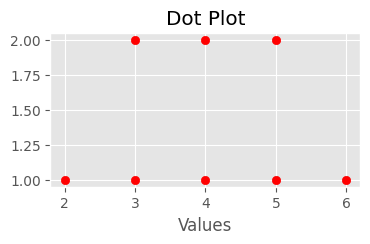
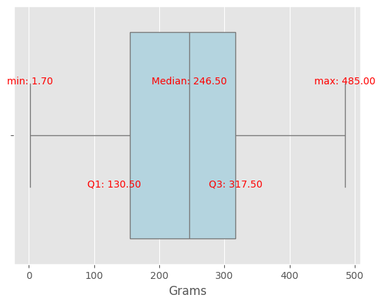
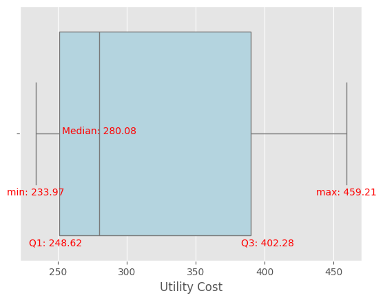

# HW0913
[](https://colab.research.google.com/drive/1TKvdy1GOr9DBrylWU2Tlb2U4siQg6Gug?usp=sharing)
[
](https://drive.google.com/drive/folders/1cVm5t9ueXS6XzFrEI5XcSlXRHSf-eAYO?usp=sharing)

## Table of Contents
- [CH01.04_Q26](#ch0104_q26)
- [CH02.01_Q02](#ch0201_q02)
- [CH02.02_Q14](#ch0202_q14)
- [CH02.04_Q02](#ch0204_q02)
- [CH02.04_Q20](#ch0204_q20)
- [CH02.04_Q24](#ch0204_q24)

## CH01.04_Q26

sorted: <br>
```
30, 30, 30, 31, 31, 32, 32, 32, 33, 33, 
34, 34, 35, 35, 35, 36, 36, 36, 36, 36, 
37, 37, 38, 38, 39, 39, 39, 40, 40, 40, 
40, 41, 41, 41, 41, 42, 42, 43, 43, 45, 
45, 46, 46, 46, 47, 48, 48, 50, 50, 55
```

|Interval (months)|ages|frequency|relative frequency|
|---|---|---:|---:|
|30-34|30, 30, 30, 31, 31, 32, 32, 32, 33, 33, 34, 34|12|0.24|
|35-39|35, 35, 35, 36, 36, 36, 36, 36, 37, 37, 38, 38, 39, 39, 39|15|0.30|
|40-44|40, 40, 40, 40, 41, 41, 41, 41, 42, 42, 43, 43|12|0.24|
|45-49|45, 45, 46, 46, 46, 47, 48, 48|8|0.16|
|50-54|50, 50|2|0.04|
|55-59|55|1|0.02|
|Total||50|1|

### a.



### b.

$(15+12)/50 = 0.54$<br>
The proportion of 35-45 month-age: **0.54**

### c.

$(12+15+12+8)/50=0.94$<br>
The probability of month-age < 50: **0.94**

## CH02.01_Q02

sorted: [2, 3, 3, 4, 4, 5, 5, 6]

- mean: 
$(2+3+3+4+4+5+5+6)/8=4$

- median: 
$(4+4)/2=4$

- mode: 
3, 4, 5

- dotplot:



## CH02.02_Q14

sorted: [40, 49, 52, 54, 59, 61, 67, 69, 70, 71]

### a. 

$range=71-30=31$

### b.

$\bar x = \frac{(40+49+52+54+59+61+67+69+70+71)}{10}=59.2$<br>

$s=\sqrt{\frac{\sum(x_i-\bar x)^2}{n-1}}=\frac{967.6}{9}=\sqrt{107.51}\approx 10.37$<br>

### c.

$\frac{range}{std}=\frac{31}{10.37}\approx 2.99$

## CH02.04_Q02

sorted: [1.0, 1.7, 2.0, 2.1, 2.3, 2.8, 2.9, 4.4, 5.1, 6.5, 7.8]<br>
mean(x_bar): 3.51<br>
sample std(s): 2.16

### z-score of minimum: 
$z\text{-}score=\frac{(1.0-3.51)}{2.16}\approx -1.16$

### z-score of maximum: 
$z\text{-}score=\frac{(7.8-3.51)}{2.16}\approx 1.98$

### Are there any outliers?
No, because $|z-score| < 3$, according to Tchebysheff’s Theorem and the Empirical Rule.


## CH02.04_Q20
sorted: <br>
```
1.7, 1.72, 5.9, 8.8, 85.4, 101.0, 118.0, 168.0, 180.0, 183.0,
209.0, 218.0, 221.0, 241.0, 252.0, 264.0, 278.0, 286.0, 314.0,
315.0, 316.0, 318.0, 329.0, 397.0, 406.0, 445.0, 481.0, 485.0
```
n: 28


### a.
- min: 1.7
- max: 485
- median: $(241+252)/2=246.5$
- Q1: <br>
$h=(28+1)*0.25=7.25$<br>
$118+(168-118)*0.25=130.5$
- Q3: <br>
$h=(28+1)*0.75=21.75$<br>
$316+(318-316)*0.75=317.5$

### b.


### c.
$IQR=317.5-130.5=187$<br>
$Lower\ bound = 130.5-1.5\*187=-150$<br>
$Upper\ bound = 317.5+1.5\*187=598$<br>
Are there any outliers? **No, since all data fall between the lower and upper fences.**

### d.
Assuming that mercury accumulates in the liver over time, it is expected that individuals from different age groups will have varying mercury concentrations. Thus, it is reasonable that the sizes of these four observations are smaller than those of the others.

## CH02.04_Q24

### a.


### b.
1. For most months, the cost falls between 248.62 and 402.28.
2. The median is closer to Q1 than Q3, so the distribution shows right-skewed.
