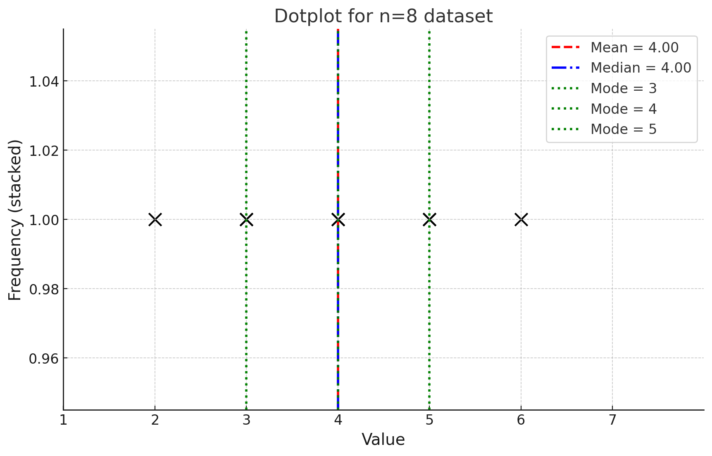

# 2
𝑛 = 8
n=8: 3, 2, 5, 6, 4, 4, 3, 5

Sorted: 2, 3, 3, 4, 4, 5, 5, 6

Mean: (2+3+3+4+4+5+5+6)/8=32

Median: average of 4th and 5th → (4+4)/2=4

Mode: 3, 4, and 5 (each appears twice → multimodal)

