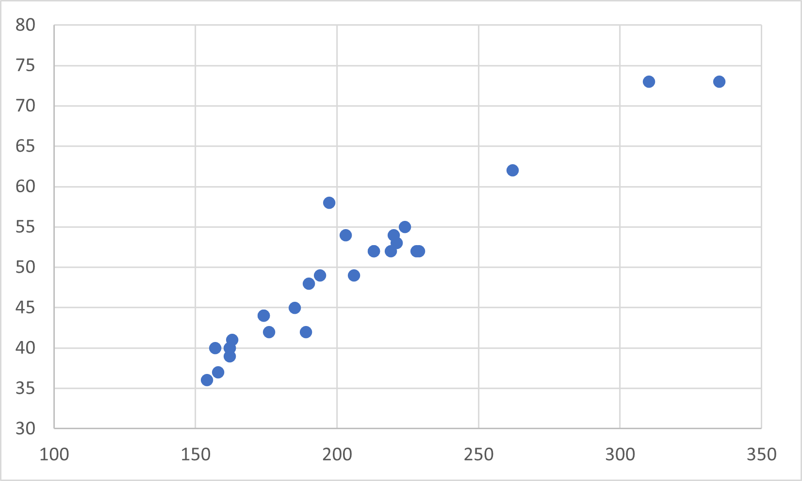

# 統計分析：大樓高度與樓層數的關係

這份文件詳細分析了大樓高度與其樓層數之間的關係，並包含了完整的計算過程與結論。所有分析均基於提供的 28 組數據。

---

### a. 自變數 (Independent) 與應變數 (Dependent)

在建築實務中，建築的總高度通常是由其規劃的樓層數所決定的。

-   **自變數 (Independent Variable), $x$**: **樓層數 (Floors)**
-   **應變數 (Dependent Variable), $y$**: **高度 (Height)**

---

### b. 相關係數 (r) 及其意義

為了計算相關係數，我們需要先計算樣本的平均數、標準差與共變異數。

<details>
<summary><strong>點此展開：詳細計算總表</strong></summary>

  

</details>

#### **1. 基本統計量**
- **樣本數, n**: 28
- **平均樓層數, $\bar{x}$**: `49.214`
- **平均高度, $\bar{y}$**: `202.857`

#### **2. 變異數與標準差**
- **樓層數標準差, $s_x$**: `9.4921`
- **高度標準差, $s_y$**: `43.7058`

#### **3. 共變異數與相關係數**
- **樣本共變異數, $s_{xy}$**: `396.8466`
- **相關係數, r**:

$$
r = \frac{s_{xy}}{s_x s_y} = \frac{396.8466}{9.4921 \times 43.7058} \approx 0.9566
$$

#### **結論**
**相關係數 $r \approx 0.957$**。
此數值表示樓層數與高度之間存在一個**非常強的正向線性關係**。

---

### c. 散佈圖與模式分析

以下是根據數據繪製的散佈圖：



- **模式 (Pattern)**: 圖表顯示了一個清晰、強烈的正向線性趨勢。數據點緊密地圍繞著一條上升的直線分佈，這與 $r \approx 0.957$ 的結論一致。

- **離群值 (Outliers)**: **第14號數據點 (58層, 197公尺)** 可被視為一個**離群值**。根據標準化殘差分析，該點的殘差值約為 3.50，其絕對值遠大於 2，表示相較於其樓層數，這棟建築的高度明顯低於模型的預期。

---

### d. 最小平方法迴歸線與預測

#### **1. 迴歸方程式**
- **斜率, $b$**:
  
$$
b = r \frac{s_y}{s_x} = 0.9566 \times \frac{43.7058}{9.4921} \approx 4.4046
$$

- **截距, $a$**:

$$
a = \bar{y} - b \bar{x} = 202.857 - (4.4046 \times 49.214) \approx -13.911
$$

因此，最小平方法迴歸線 (least-squares line) 的方程式為：
```math
\text{預測高度} = -13.911 + 4.4046 \times (\text{樓層數})
```

#### **2. 高度預測**
要預測一棟有 **48 層樓**的建築高度，將 $x = 48$ 代入方程式：
```math
\text{預測高度} = -13.911 + 4.4046 \times (48) \approx 197.51
```

**結論：根據此模型，我們預測一棟有 48 層樓的建築，其高度約為 197.5 公尺。**
