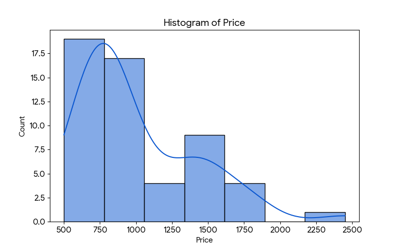
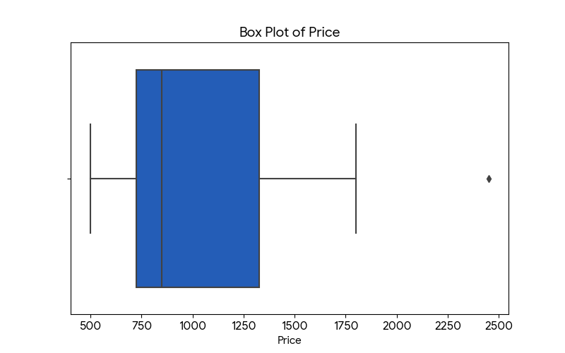
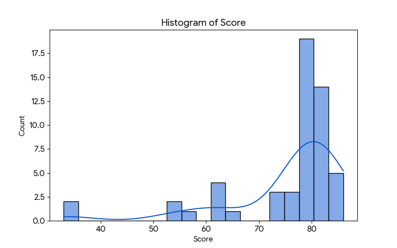
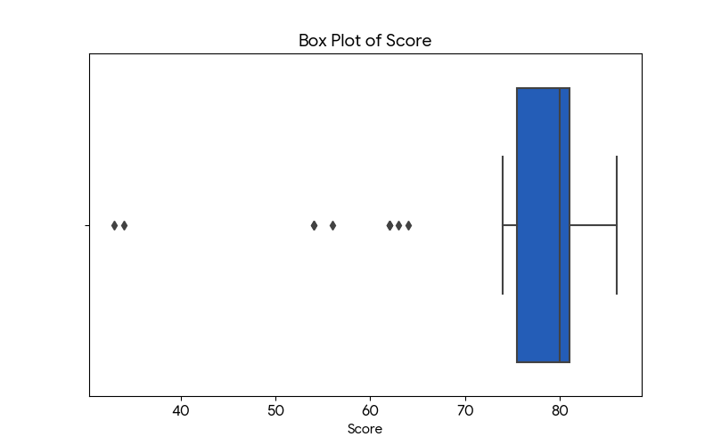
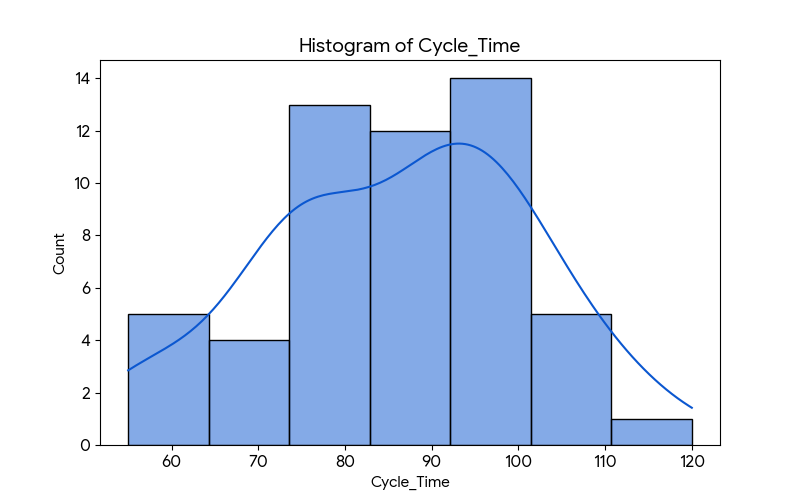
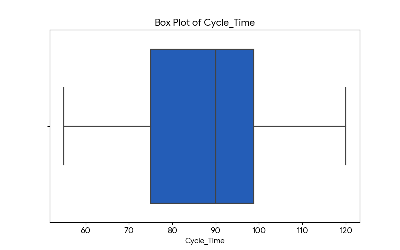
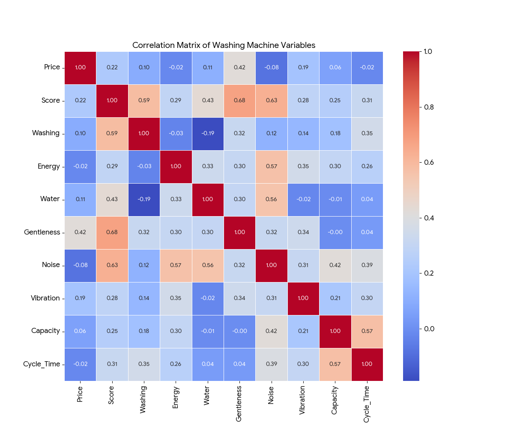

# 洗衣機數據集分析報告 (GitHub 格式)

本報告旨在分析54款前置式洗衣機的各項性能指標，探索價格、評分、功能等變數之間的關係。

---
---

## 1. 變數的獨立分析 (Price, Score, Cycle Time)

我們首先獨立檢視價格、總評分和洗衣時間這三個關鍵變數的分佈、對稱性及離群值。

### **價格 (Price)**

-   **分佈與對稱性**: 價格分佈呈現顯著的**右偏態 (positively skewed)**，偏度係數約為 1.31。這表示大多數洗衣機的價格集中在較低區間，但有少數幾款的價格非常高。
-   **離群值**: 箱形圖顯示有**多個高價位的離群值**，特別是價格超過 $1700 的機型，例如 Speed Queen 的某款售價高達 $2450。

### **總評分 (Score)**

-   **分佈與對稱性**: 總評分分佈呈現強烈的**左偏態 (negatively skewed)**，偏度係數約為 -2.25。這表示絕大多數洗衣機的評分都集中在較高的分數區間（75-85分），只有極少數產品的評分非常低。
-   **離群值**: 箱形圖顯示有**兩個低分的離群值**（分數低於40分），這兩款產品的性能遠遜於市場上的大多數產品。

### **洗衣時間 (Cycle Time)**

-   **分佈與對稱性**: 洗衣時間的分佈**大致對稱**，偏度係數約為 -0.19，非常接近0。數據分佈相對均勻，沒有明顯的偏斜。
-   **離群值**: 該變數**沒有明顯的離群值**，所有產品的洗衣時間都在一個合理的範圍內。

---

## 2. 變數的成對相關性分析

為了理解各個變數之間的相互關係，我們計算了所有數值變數的相關係數矩陣，並將其視覺化為熱圖。

#### **主要的顯著相關性**
-   **強正相關**:
    -   `Score` 與 `Gentleness` (溫和度) 的相關係數最高 (r=0.68)，表示對衣物越溫和的洗衣機，總評分越高。
    -   `Score` 與 `Noise` (靜音度) (r=0.63) 及 `Washing` (洗淨力) (r=0.59) 也有很強的正相關。
-   **中等正相關**:
    -   `Cycle Time` (洗衣時間) 與 `Capacity` (容量) (r=0.57) 呈正相關，容量越大的洗衣機通常洗衣時間越長。
    -   `Noise` 與 `Energy` (r=0.57) 及 `Water` (r=0.56) 呈正相關，越安靜的型號通常在節能和節水評分上越高。
-   **負相關**:
    -   在此數據集中，**沒有顯著的負相關**。`Price` 與 `Noise` (r=-0.08) 幾乎不相關。

#### **反直覺的結果**
-   **`Price` 與 `Score` 的相關性較弱** (r=0.22)。這是一個值得注意的點，表示**價格高昂並不直接等同於總評分的大幅提升**。消費者支付的更高價格可能反映在其他方面，如品牌、特定功能或耐用性上，而不僅僅是這個評分系統所衡量的性能。
-   `Washing` (洗淨力) 與 `Water` (節水性) 呈微弱負相關 (r=-0.19)，這可能暗示著，要達到更高的洗淨效果，可能需要消耗更多的水，這在工程設計上是合理的權衡。

---

## 3. 價格是否能反映品質？

**結論：在一定程度上，價格「是」品質的指標，但這個關聯性並不全面，且主要體現在特定幾個方面。**

-   **支持此論點的變數**:
    -   **溫和度 (Gentleness)**: `Price` 與 `Gentleness` 的相關性是所有品質指標中最高的 (r=0.42)。這表示消費者支付的更高價格，有很大可能換來了對衣物更溫和的處理，這是一個重要的品質特徵。
    -   **總評分 (Score)**: `Price` 與 `Score` 存在正相關 (r=0.22)，雖然不強，但方向是正面的，表示價格較高的產品總體評分趨向於更高。

-   **不支持此論點的變數**:
    -   **核心性能指標**: `Price` 與 `Washing` (洗淨力) (r=0.10), `Energy` (節能) (r=-0.02), `Water` (節水) (r=0.11) 的相關性都非常低。這意味著**單純從價格無法判斷一款洗衣機是否洗得乾淨、省電或省水**。
    -   **使用體驗指標**: `Price` 與 `Noise` (靜音度) 甚至呈現微弱的負相關 (r=-0.08)，表示價格與是否安靜無關。

**總體來說，價格似乎更多地反映了像「溫和度」這樣的高階品質特性，而不是基礎的洗淨或節能效果。消費者在選擇時，不能僅憑價格判斷洗衣機的整體品質。**

---
### **附錄：所有生成的圖表**
- [Price Histogram](price_histogram.png)
- [Price Box Plot](price_boxplot.png)
- [Score Histogram](score_histogram.png)
- [Score Box Plot](score_boxplot.png)
- [Cycle Time Histogram](cycle_time_histogram.png)
- [Cycle Time Box Plot](cycle_time_boxplot.png)
- [Correlation Heatmap](correlation_heatmap.png)
